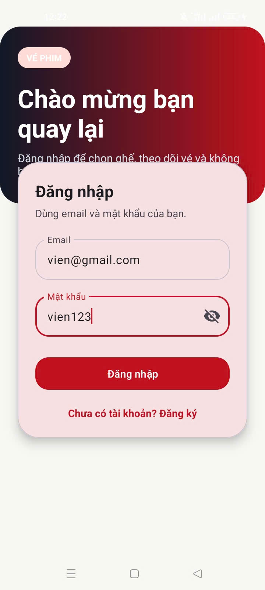
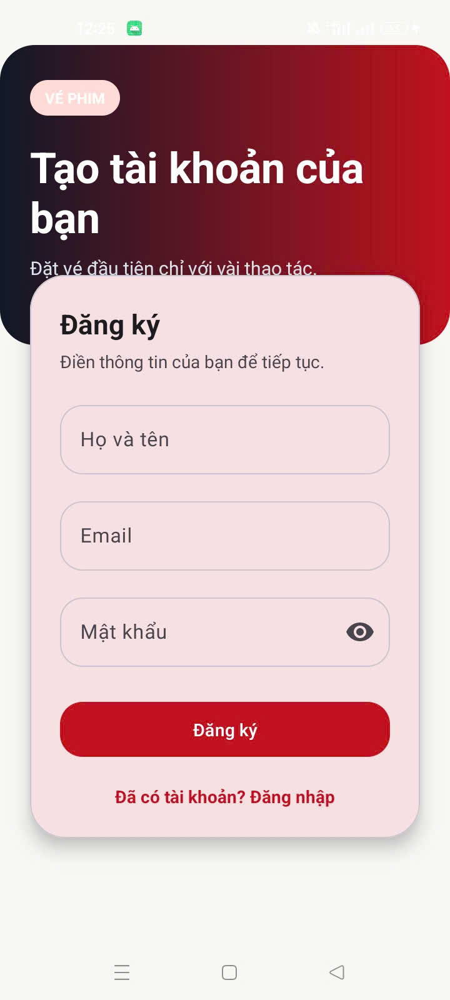
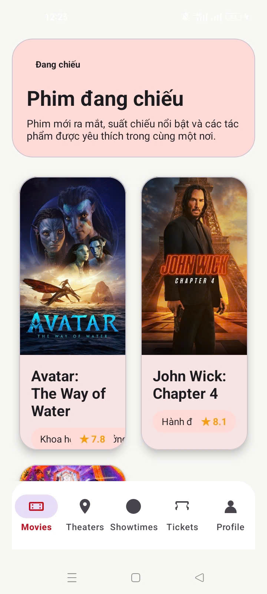
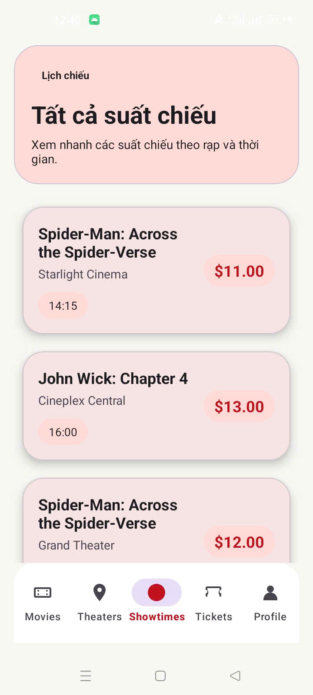
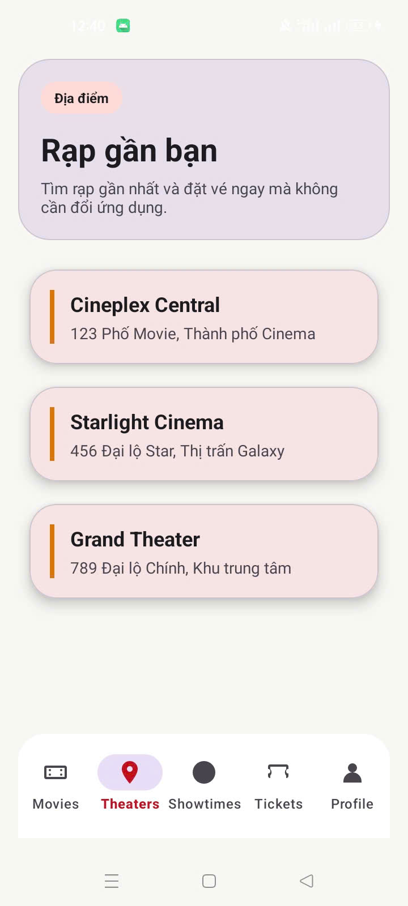
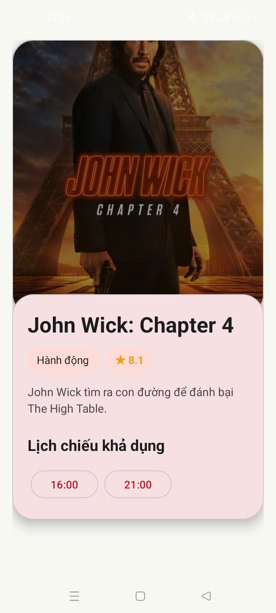
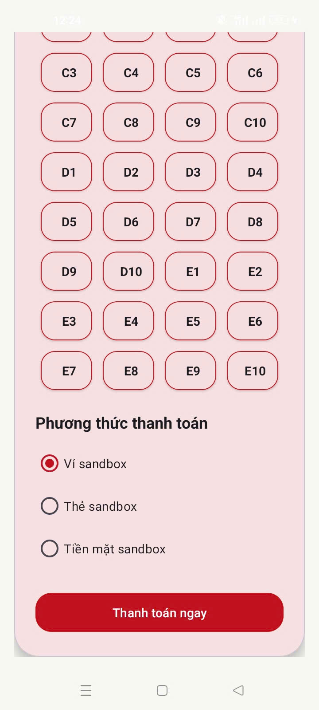
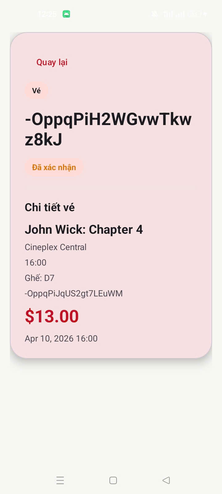
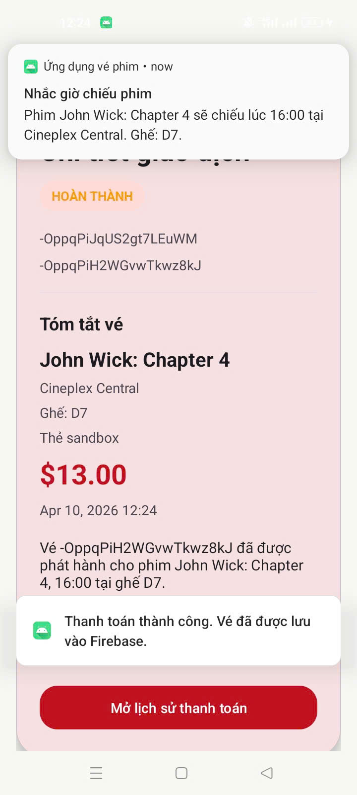

# Movie Ticket App

Ứng dụng đặt vé xem phim Android với giao diện tiếng Việt, tích hợp Firebase Auth, Realtime Database, lịch sử thanh toán, chi tiết vé và nhắc lịch chiếu.

## Tính năng chính

- Đăng ký, đăng nhập, đăng xuất
- Xem danh sách phim, rạp, suất chiếu
- Chọn ghế và đặt vé
- Thanh toán sandbox
- Lưu dữ liệu lên Firebase Realtime Database
- Xem lịch sử thanh toán và chi tiết vé
- Thông báo xác nhận đặt vé và nhắc giờ chiếu

## Ảnh giao diện

Bạn có thể chèn ảnh vào thư mục `docs/screenshots/` rồi cập nhật đường dẫn bên dưới.

### 1. Màn hình đăng nhập



### 2. Màn hình đăng ký



### 3. Danh sách phim



### 4. Danh sách lịch chiếu



### 5. Danh sách phim



### 6. Chi tiết phim



### 7. Chọn ghế và thanh toán




### 9. Chi tiết vé



### 10. Thông báo nhắc giờ chiếu



## Cấu hình Firebase

- Project hiện đang dùng Firebase Realtime Database và Firebase Auth.
- File cấu hình: `app/google-services.json`
- URL Realtime Database được khai báo trong app để trỏ đúng instance hiện tại.

## Chạy ứng dụng

```bash
./gradlew :app:assembleDebug
```

Sau khi build xong, cài APK debug lên máy/emulator để kiểm tra giao diện và luồng đặt vé.
